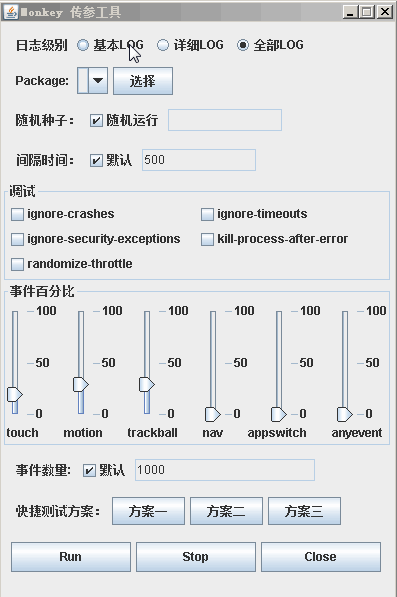

# PCRunMonkey

Monkey 传参工具设计-PC端

##**Situation：**

1、每次使用Monkey传参都不方便。

2、使用脚本不够形象，以图形界面方式进行启动。

3、编写过Android启动Monkey，无法成功启动理由：

    1、通过实践：通过 Runtime.getRuntime().exec 调用 monkey 问题无法解决
    2、非Root或同一签名App 

[原文链接](http://stackoverflow.com/questions/20518745/how-is-it-possible-to-run-monkey-from-android-app)

##**Tast**
1、掌握图像编程，需要了解图形、事件、侦听等类的使用。

2、设计工具的整体布局。

3、确定那些需要实现功能。

4、方便非专业用户的使用

##**Action**

###确定实现的功能：

1、实现图形界面的方式，传递参数功能

2、实现快捷启动功能“方案一”、方案二等功能

3、实现连接手机后获取已安装的 package信息。

4、实现启动时，判断是否已启动Monkey

5、实现停止正在运行的Monkey

6、实现日志保存在自定义目录下，目录以时间命名<未实现>

7、实现导出日志按钮<未实现>

8、实现批处理启动应用，不要打包成exe <未实现>

###遇到的问题：

1、使用JDK1.8 不支持 Java swing （JPanel、JLabel、JFrame等）图形类?

    安装JDK1.8，可以在Eclipse中，调整为JDK1.7编译环境即可。

2、如何调用外部命令？

    调用外部命令使用：Runtime.getRuntime().exec(String cmd)
    
3、调用外部命令时，造成线程阻塞（点击按钮后，一直显示等待状态，其它功能无法使用<类似假死>）

    主要分四步解决：
    1. 封装Runtime.getRuntime().exec(String cmd) 方法名为：execCommand;（CommandUtil.java）
    2. execCommand()中，在waitfor 插入WatchThread的处理代码（CommandUtil.java）
    3. 编写类继承Thread，再次封装execCommand，添加构造方法、启动方法。(MonkeyThread.java)
    4. 调用带参数的构造方法，启动

4、如何通过使用多个JSilder，控制调试参数百分比？

    主要思想为：
    1、当用户对某个滑条进行增量操作时，启动侦听事件，总体数据超过100时，对其他滑条进行减量操作。
    2、不对用户的减量操作响应。
    备注：因算法较为繁复，不细讲(该功能还存在Bug)

##**Result**

###成果：

1、已完成各功能，以友好的界面展示。

2、对非专业用户，提供快捷的运行方案。

###说明
1、选择测试应用前，必现连接手机；选择的应用为第三方App，若找不到先要的package，自行修改代码。

2、调试、与事件百分比仅实现常用功能；可根据需要自行修改。

3、事件百分比的数值，存在小bug，导致获取数值不准确的问题。

###效果

